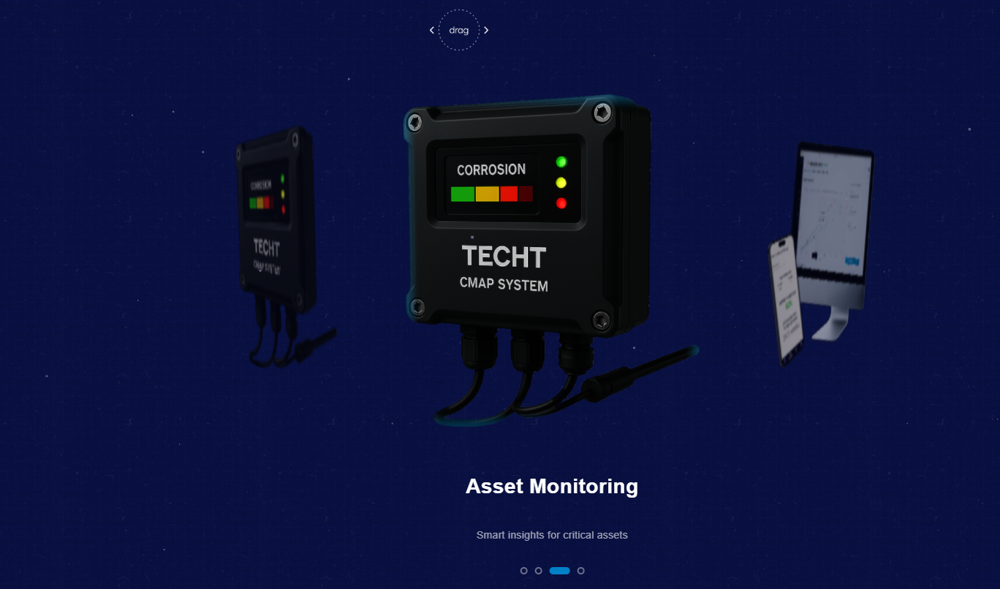

# Dreamy 3D Slider ✨

A smooth, draggable **3D slider** built with **Three.js**, designed to feel modern, cinematic, and interactive.

This project features a clean 3D carousel-style slider where items rotate in 3D space as you drag, with blur and depth effects applied to non-focused objects for a dreamy visual experience.

---

## 📸 Preview

---

## 🚀 Features

- 🎠 Smooth **3D rotating slider**
- 🖱️ Drag-to-navigate (mouse + touch support)
- 👆 On-screen drag indicator (user knows it's draggable)
- 🌫️ Depth blur effect for non-focused slides
- 🎯 Focused center item always stays sharp
- 🌀 Smooth animation transitions
- 📱 Responsive and mobile-friendly

---

## 🛠 Built With

- [Three.js](https://threejs.org/) — WebGL 3D engine
- JavaScript / ES6
- HTML + CSS
